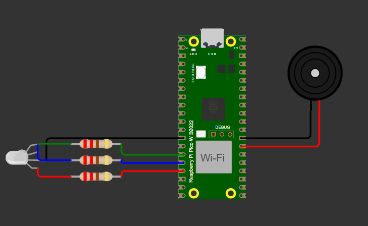

# Controle de GPIOs com BitDogLab

## Descrição do Projeto
Este projeto implementa o controle de pinos GPIO utilizando a ferramenta educacional BitDogLab (versão 6.3) com o microcontrolador RP2040. A interação é realizada por meio da porta serial UART, interpretando comandos digitados pelo usuário para acionar LEDs RGB e um buzzer. A estrutura do projeto foi organizada para facilitar a modularização e a integração dos componentes.

## Demonstração do projeto

<video height="365" src="./assets/presentation.mp4" controls></video>

## Funcionamento
1. **Comandos Disponíveis:** O sistema aceita os seguintes comandos:
    - `OFF`: Desliga todos os LEDs.
    - `RED`: Liga o LED vermelho.
    - `GREEN`: Liga o LED verde.
    - `BLUE`: Liga o LED azul.
    - `WHITE`: Liga todos os LEDs (branco).
    - `YELLOW`: Liga os LEDs vermelho e verde (amarelo).
    - `CYAN`: Liga os LEDs azul e verde (ciano).
    - `MAGENTA`: Liga os LEDs vermelho e azul (magenta).
    - `BUZZER`: Aciona o buzzer por 500ms.
2. **Hashing:** O comando digitado pelo usuário é convertido para maiúsculas e então um hash é gerado para identificá-lo.
3. **Ação:** O sistema utiliza o hash para identificar a ação correspondente e aciona o LED ou o buzzer conforme necessário.

## Arquivos do Projeto
- **`atividade2_u4.c`:** Arquivo principal do programa, contendo o loop principal e as funções de controle dos LEDs e do buzzer.
- **`hash.c` e `hash.h`:** Módulos para geração de hash dos comandos digitados.
- **`diagram.json`:** Diagrama do circuito criado no Wokwi.

## Estrutura do Circuito
O circuito foi desenvolvido no Wokwi e inclui os seguintes componentes:
- 3 LEDs RGB conectados aos GPIOs 11, 12 e 13.
- 1 Buzzer conectado ao GPIO 21.

## Divisão de Tarefas
- **Caique:** Integração dos módulos e teste final do sistema, garantindo o funcionamento do circuito físico e o alinhamento com os requisitos do enunciado.
- **Devid:** Criação do circuito no simulador Wokwi, gerando o arquivo `diagram.json` para a representação do hardware.
- **Diego:** Implementação e teste do acionamento do buzzer na placa RP2040, incluindo a configuração do PWM.
- **Juan:** Desenvolvimento do controle de LEDs RGB, incluindo as funções para manipulação das cores.
- **Renan:** Criação dos arquivos `hash.c` e `hash.h` para o cálculo do hash dos comandos, além da implementação da função para capturar os comandos digitados pelo usuário.

## Como Executar

1. Faça o clone do desse repositório:
``
git clone https://github.com/caiquedebrito/atividade2_u4.git
``
2. Conecte a ferramenta educacional BitDogLab ao computador por meio de um cabo micro-USB.
3. Compile e carregue o código no microcontrolador RP2040.
4. Utilize um terminal serial (ex.: PuTTY) para enviar os comandos ao microcontrolador.
5. Observe o comportamento dos LEDs e do buzzer conforme os comandos enviados.

## Conclusão
Gostaríamos de agradecer à equipe do Embarcatech por proporcionar esta atividade desafiadora e enriquecedora. Foi uma experiência nova que agregou bastante a cada integrante do grupo, tanto individualmente quanto coletivamente, permitindo-nos desenvolver habilidades práticas em sistemas embarcados e colaboração em equipe.

